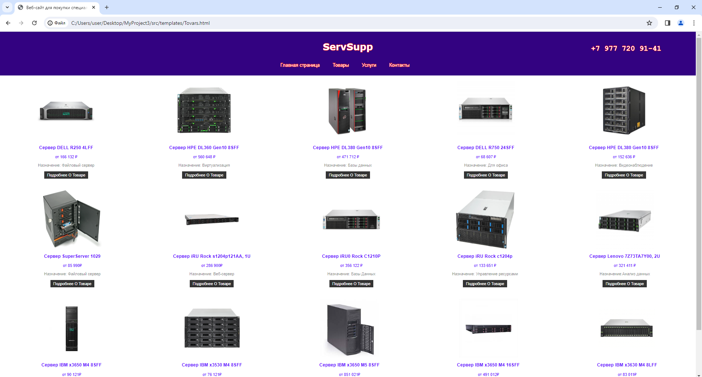
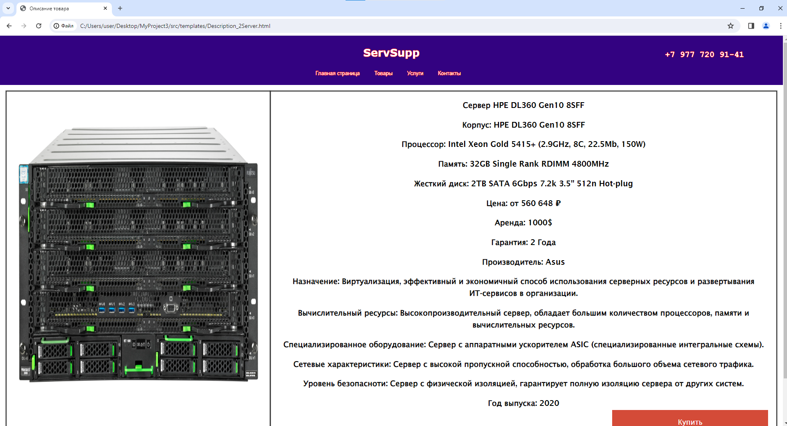
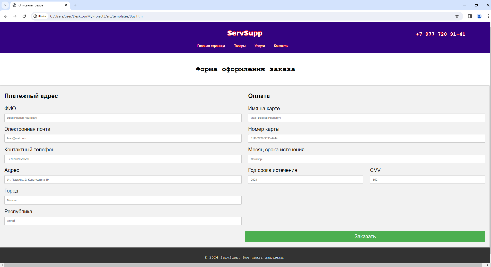
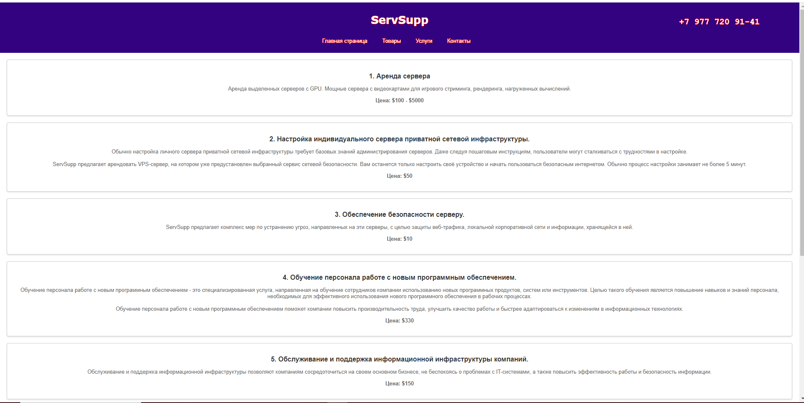

# MyProject3
 Индивидуальный проект по теме: Разработка сайта для размещения советов по воспитанию детей всех возрастов

<h2>Создание веб-сайта</h2>
 Веб-сайт был разработан в 2024 году с целью практической подготовки по проекту и набором опыта в создании серверов на базе HTML и CSS.</h2>
 Для запуска сайта потребуется <a href="https://www.python.org/downloads/">python 3.12</a> и <a href="https://www.docker.com/products/docker-desktop/">Docker desktop</a>

<h2>Предназначение веб-сайта</h2>
 Веб-сайт предназначен для покупки или аренды серверов или приобретении услуг связанных с серверами и IT сферой в целом.
 
<h2>Преимущества веб-сайта по сравнению с конкурентами</h2>
 Веб-сайт ServSupp отличается своей несложной структурой и достаточно облегченным интерфейсом с обьективными ценами на продукты и услуги. Также о каждом продукте имеется подробная информация, что позволяет клиентам
 эффективнее подобрать определенный сервер для своих целей.
<h2>Установка веб-сайта</h2>
 Для установки продукта требуется зайти по <a href="https://github.com/Tatieg/MyProject3/archive/refs/heads/main.zip"> ссылке </a> на установку сайта, установить его и после разместить папку с сайтом по такому путю C:\Users\user\...
  Также потребуется <a href="https://www.python.org/downloads/">python 3.12</a> и <a href="https://www.docker.com/products/docker-desktop/">Docker desktop</a>
   После выполните в cmd:
    <pre> 
     cd *папка с сайтом*/src
      docker build -t aa . && docker run -p 5000:5000 aa
    </pre>
<h2>Пользование продуктом</h2>
 После успешного выполнения всех действий вы можете начать пользоваться сайтом, также его можно взять в качестве шаблона к своему сайта и подсмотреть код, позаимствуя тот или иной отрывок для своих проектов.
<h2>Помощь продукту</h2>
 Если захотите помочь продукту то попробуйте распространить данный шаблон в ещё большие круги для его усовершенствования и модифицирования.
<h2>Разработчик продукта</h2>
 Разработчиком является студент 1 курса по направлению сетевое и системное администратирование. (Не стоит воспринимать веб-сайта всерьёз, это лишь первая работа).
<h2>Скриншоты работы веб сайта:</h2>

 ПРоектик